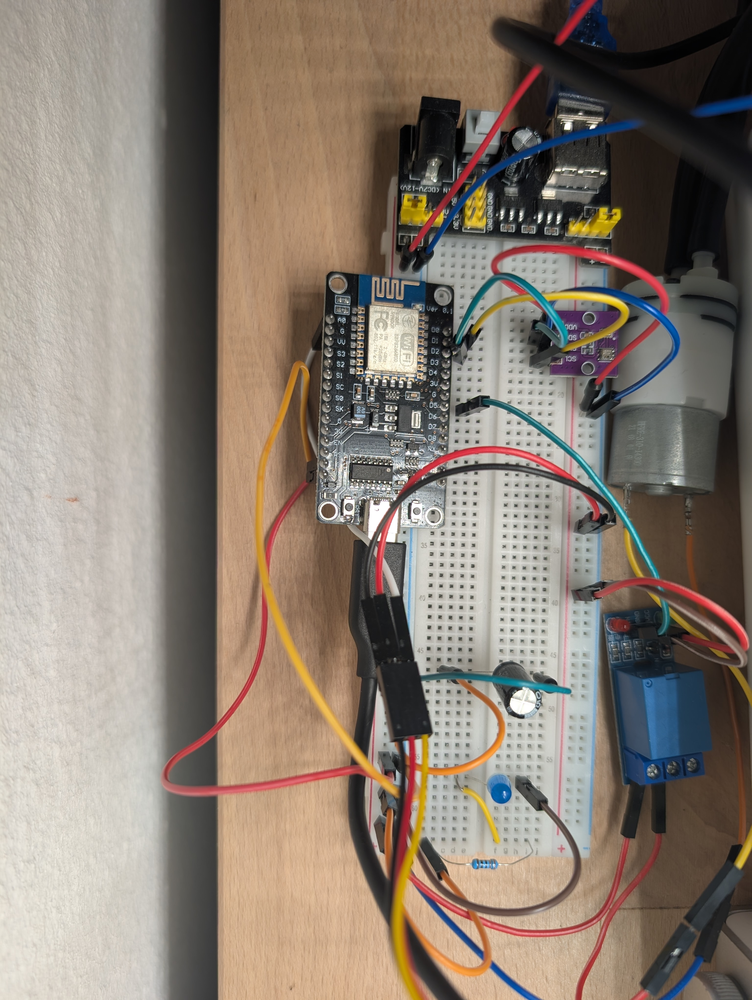

# ESP8266 Irrigation REST API

A simple REST API for the ESP8266 running on MicroPython



## Features

- Capture soil moisture data via HTTP endpoint
- Captures temperature and humidity data via HTTP endpoint
- Control a water pump via HTTP endpoint
- Basic health check endpoint

## API Endpoints

- `GET /` - Health check
- `GET /climate` - Get the current temperature and humidity
- `GET /soil_moisture` - Get the current soil moisture level
- `GET /irrigate` - Turn on the irrigation pump for a specified duration

## Prerequisites

1. Install the dev requirements `pixi install`
2. Flash the ESP8266 firmware:
   - Download the MicroPython firmware from [esp8266-micropython](hhttps://micropython.org/download/ESP8266_GENERIC/)
   - I am using ESP8266_GENERIC-20250415-v1.25.0
   - Flash it using esptool.py
3. Connect a relay with a water pump to GPIO 14 (D5) of the ESP8266
4. Connect a temperature and humidity sensor (AHT20) to GPIO 5 + 4 (D1 + D2) of the ESP8266
5. Connect a soil moisture sensor (Capacitive Soil Moisture Sensor v.2) to ADC0 (A0) of the ESP8266

## Setup
1. Copy the .env.example file to .env `cp .env.example .env`
2. Update the WiFi credentials in `.env`
3. Run the install script `pixi run install` (while the ESP8266 is connected)

## Usage

After setting up, the API will be available at `http://esp8266-irrigation`

Example using curl:
```bash
# Get health status
curl http://esp8266-irrigation/

# Control irrigation
curl http://esp8266-irrigation/irrigate

# Get temperature and humidity
curl http://esp8266-irrigation/climate
```

## Credits and Acknowledgments

This project builds upon the work of several open source projects and resources:

- [MicroPython](https://micropython.org/) - The core Python implementation for microcontrollers
- [microdot](https://github.com/miguelgrinberg/microdot) - Modern and lightweight web framework for MicroPython
